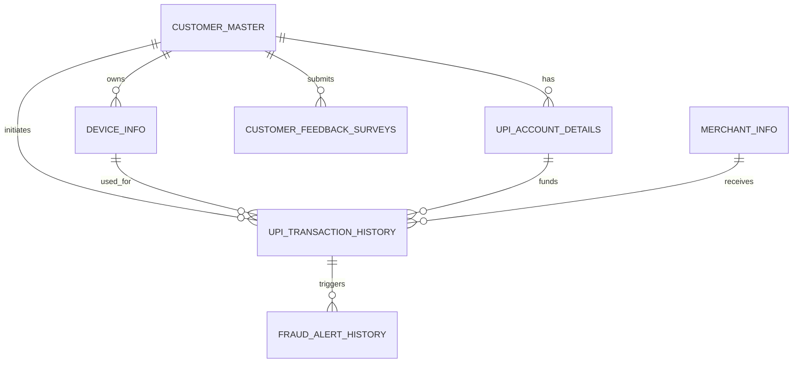

```mermaid
erDiagram
CUSTOMER_MASTER ||--o{ DEVICE_INFO : owns
CUSTOMER_MASTER ||--o{ UPI_ACCOUNT_DETAILS : has
CUSTOMER_MASTER ||--o{ UPI_TRANSACTION_HISTORY : initiates
CUSTOMER_MASTER ||--o{ CUSTOMER_FEEDBACK_SURVEYS : submits
DEVICE_INFO ||--o{ UPI_TRANSACTION_HISTORY : used_for
UPI_ACCOUNT_DETAILS ||--o{ UPI_TRANSACTION_HISTORY : funds
MERCHANT_INFO ||--o{ UPI_TRANSACTION_HISTORY : receives
UPI_TRANSACTION_HISTORY ||--o{ FRAUD_ALERT_HISTORY : triggers
```